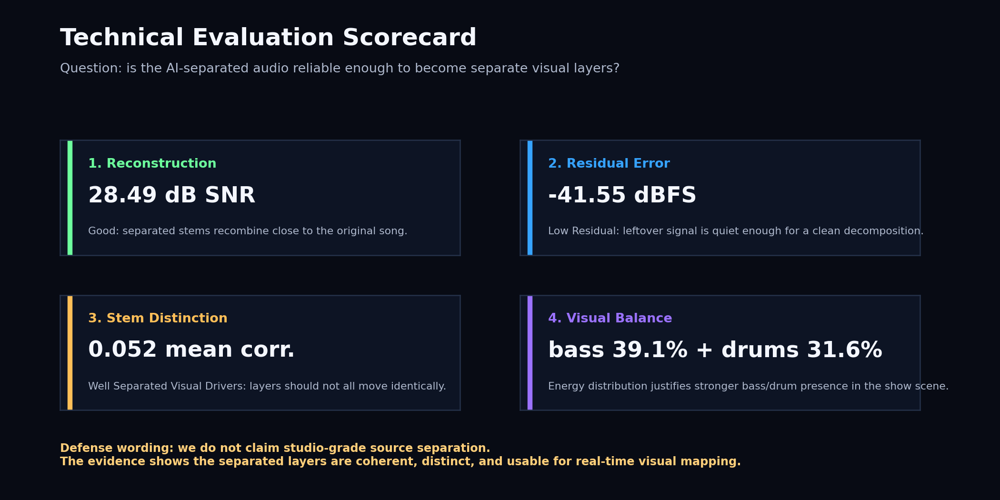
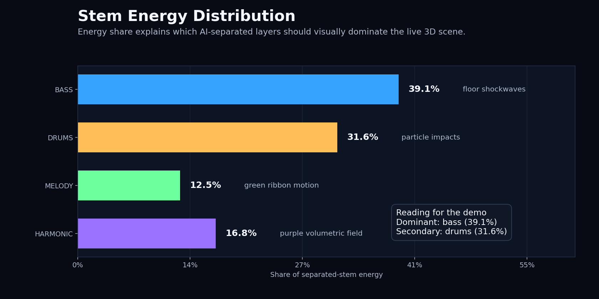
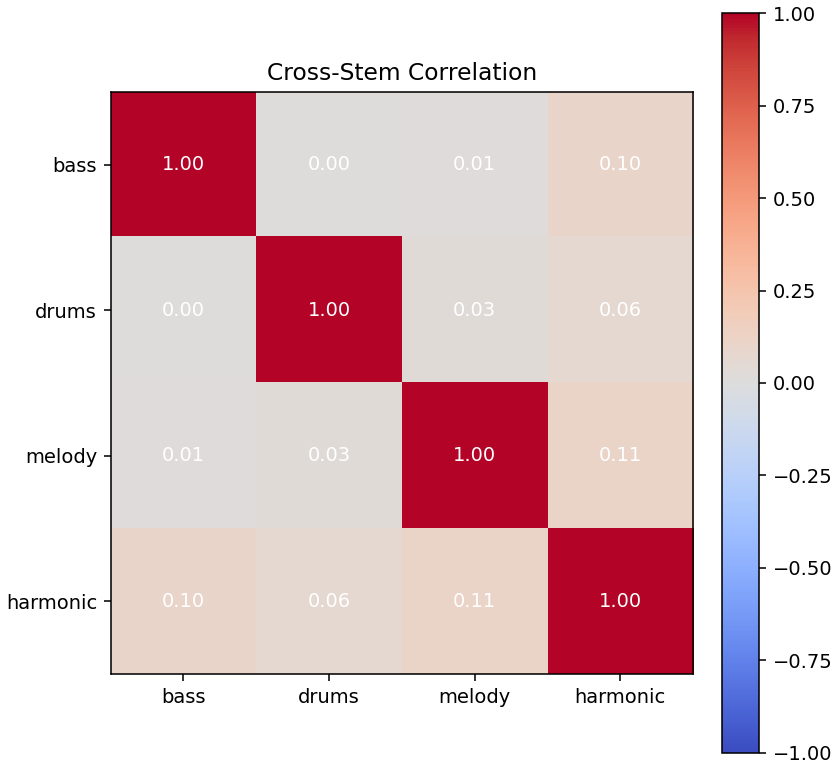
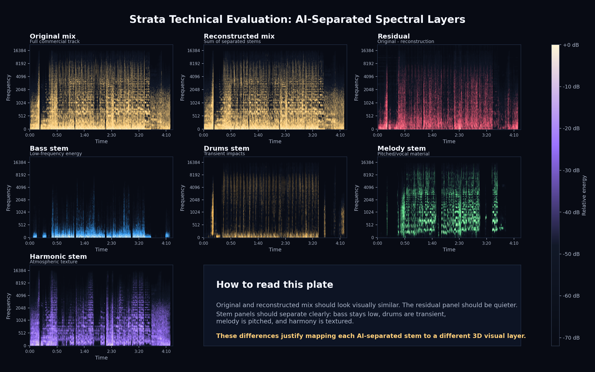

# Strata Technical Evaluation

Audio: `test_music.mp3`

Evaluated duration: **262.571 s**

## Evaluation Claim

**The separated stems are technically coherent enough to drive the real-time 3D visualization.**

This is the technical part of the G01 concept question: can AI source
separation reveal hidden musical layers strongly enough that each layer can
drive its own visual behavior?

## Concept Alignment

| G01 concept requirement | Technical evidence in this report | Status |
| --- | --- | --- |
| Demucs separates the song into four stems | Bass, drums, melody, and harmonic stems are measured separately | satisfied |
| The separated stems should still represent the original song | Reconstruction SNR and residual RMS compare original mix vs. sum of stems | satisfied |
| Hidden layers should become visually distinct | Spectrograms and cross-stem correlation check whether stems have different signatures | satisfied |
| SDR/SIR/SAR-style ground-truth scoring | Requires isolated studio stems, which are not available for the commercial demo track | limitation, explained honestly |

## What We Can Honestly Evaluate

This evaluation uses a commercial track without isolated ground-truth stems.
Therefore, it does not claim absolute SDR/SIR/SAR separation quality. Instead,
it verifies whether the separated stems are technically coherent enough to drive
the real-time visual system.

The important defense point is not "Demucs is perfect." The defensible claim is:
the decomposition is complete enough, distinct enough, and stable enough for the
visual computing system we built.

## Reconstruction Consistency

- Reconstruction SNR: **28.49 dB**
- Mix RMS: **-13.06 dBFS**
- Residual RMS: **-41.55 dBFS**

### How To Read These Numbers

| Metric | Plain meaning | Rough guide | Our result |
| --- | --- | --- | --- |
| Reconstruction SNR | How close the sum of separated stems is to the original mix. Higher is better. | `<10 dB` weak, `10-20 dB` usable, `20-30 dB` good, `>30 dB` very strong. | **28.49 dB**, which is in the good range and close to very strong. |
| Mix RMS | Average loudness of the original track. This is a reference level, not a quality score. | Digital audio peaks at `0 dBFS`; mastered pop tracks often sit around `-20` to `-10 dBFS` RMS. | **-13.06 dBFS**, a normal energetic pop-mix level. |
| Residual RMS | Loudness of the leftover error after subtracting the reconstructed mix from the original. Lower/more negative is better. | Around `-40 dBFS` means the leftover error is relatively quiet compared with the song. | **-41.55 dBFS**, meaning the residual is low. |

Interpretation: the four separated stems are summed back into a reconstructed
mix and compared with the original mix. A smaller residual supports that the
visualization is driven by a complete decomposition of the song, not by
unrelated or missing audio layers.

### Pass Criteria For Our Demo

| Question | Evidence | Result |
| --- | --- | --- |
| Do the stems recombine into the original mix? | Reconstruction SNR above 20 dB is a good consistency signal | **good** |
| Is the reconstruction error quiet? | Residual around or below -40 dBFS means the leftover signal is low | **low residual** |
| Are the stems different enough to control separate visuals? | Low mean cross-stem correlation means the layers are not all identical | **well separated visual drivers** |

## Stem Energy Distribution

This section answers a visual-design question: which separated layers should
feel strongest in the final show scene? For this track, bass and drums carry
most of the measured stem energy, so it is reasonable that the blue floor
shockwaves and gold particle impacts feel more dominant than the melody ribbon.

| Stem | Energy share | RMS |
| --- | ---: | ---: |
| bass | 39.1% | -17.83 dBFS |
| drums | 31.6% | -18.75 dBFS |
| melody | 12.5% | -22.80 dBFS |
| harmonic | 16.8% | -21.50 dBFS |

## Stem Bleed Proxy

Mean absolute cross-stem correlation: **0.052**

How to read it: a value near `0` means two stem control signals are mostly
independent; a value near `1` would mean they move together. Lower off-diagonal
correlation suggests that stems carry more distinct signal content. Some
correlation is expected because the original track is mastered as a cohesive
mix.

| Stem | Bass | Drums | Melody | Harmonic |
| --- | ---: | ---: | ---: | ---: |
| bass | 1.000 | 0.004 | 0.011 | 0.102 |
| drums | 0.004 | 1.000 | 0.025 | 0.061 |
| melody | 0.011 | 0.025 | 1.000 | 0.111 |
| harmonic | 0.102 | 0.061 | 0.111 | 1.000 |

## Spectrogram Inspection

The plate below compares the original mix, reconstructed mix, residual, and the
four separated stems. This is the main visual proof for the technical pipeline:
different spectral regions and transient structures map to different visual
layers in the Three.js scene.

What the audience should notice:

- The original and reconstructed mix have similar spectral structure.
- The residual is visibly quieter than the full mix.
- Bass concentrates in lower frequencies.
- Drums appear as repeated transient vertical structures.
- Melody and harmony occupy different pitched/textural regions.

## Presentation Sentence

> We do not have studio ground-truth stems for the commercial track, so we avoid
> claiming absolute SDR/SIR/SAR. Instead, we evaluate whether the AI-separated
> stems are complete, distinct, and stable enough to drive separate real-time
> visual layers. The reconstruction SNR, residual level, correlation matrix, and
> spectrogram inspection support that claim.

## Assets

- `technical_summary.json`
- `technical_scorecard.png`
- `spectrogram_plate.png`
- `stem_energy_distribution.png`
- `stem_correlation_heatmap.png`
