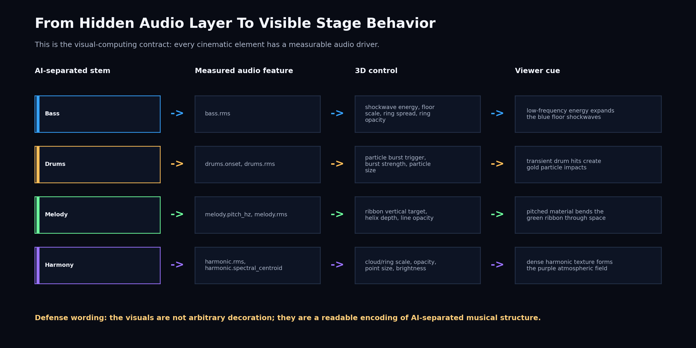
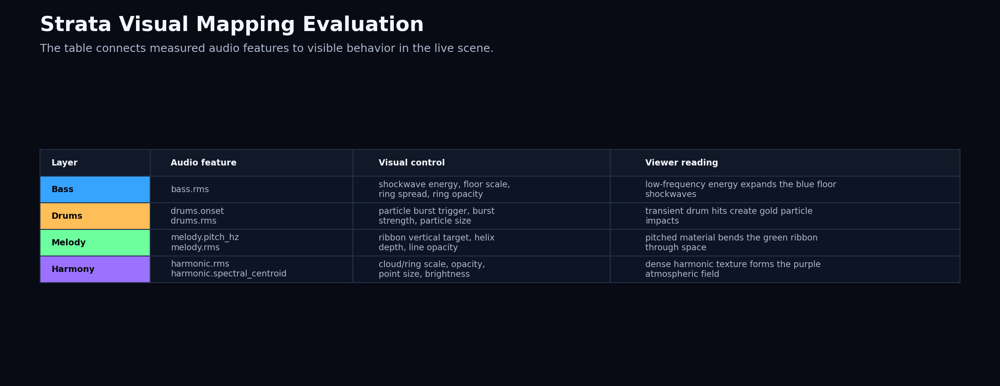
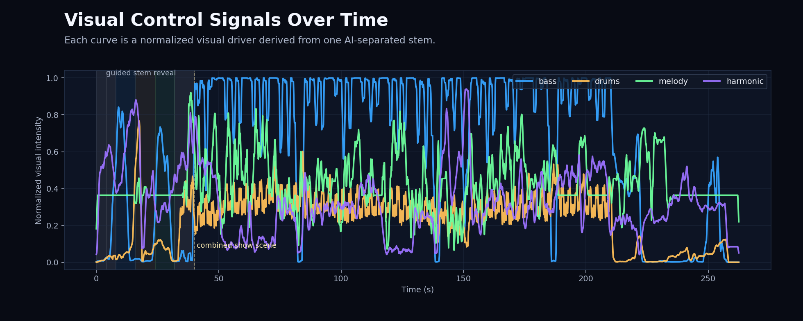
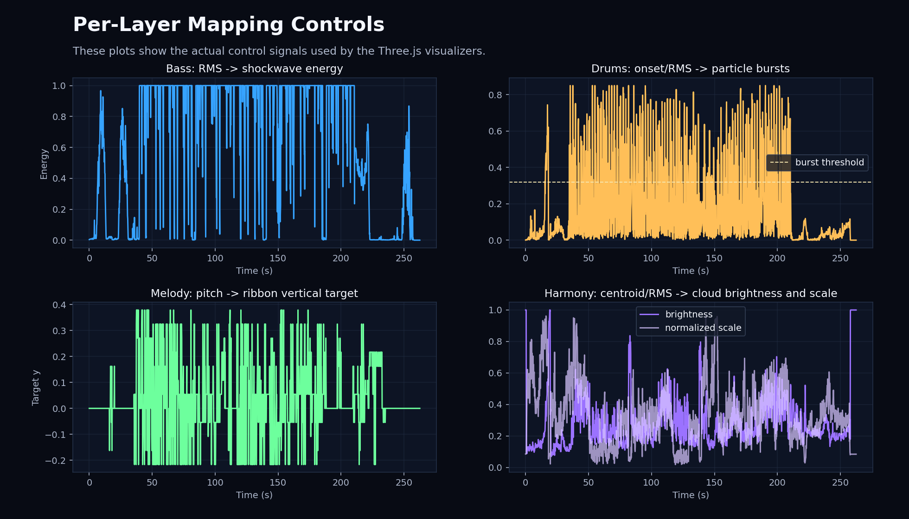

# Strata Visual Mapping Evaluation

This evaluation documents how audio analysis features are translated into
visual parameters in the Three.js demo. It answers the visual-computing
question behind the G01 concept: are the hidden musical layers not only
separated by AI, but also encoded as readable, distinct, real-time visual
behaviors?

Feature timeline: `features.json`  
Duration: **262.571 s**  
Frames: **22617** at **86.133 fps**

## Evaluation Claim

The visual system is data-driven rather than decorative: each visible layer has
a specific stem, feature input, control formula, and viewer-facing cue.

## Concept Alignment

| G01 concept requirement | Visual mapping evidence | Status |
| --- | --- | --- |
| Hidden musical layers become simultaneously visible | Four stem-specific visual layers are mapped and measured | satisfied |
| Each stem independently drives its own 3D visual layer | Mapping table links stem features to visual controls | satisfied |
| Real-time playback-rate feature streaming | Feature timeline contains **22617** frames at **86.133 fps** | satisfied |
| Interactive/presentation-ready explanation | Phase mapping separates opening, stem reveal, combined scene, and closing | satisfied |

## Mapping Table

| Visual layer | Audio feature input | Visual parameter output | Viewer interpretation |
| --- | --- | --- | --- |
| Bass | `bass.rms` | shockwave energy, floor scale, ring spread, ring opacity | low-frequency energy expands the blue floor shockwaves |
| Drums | `drums.onset, drums.rms` | particle burst trigger, burst strength, particle size | transient drum hits create gold particle impacts |
| Melody | `melody.pitch_hz, melody.rms` | ribbon vertical target, helix depth, line opacity | pitched material bends the green ribbon through space |
| Harmony | `harmonic.rms, harmonic.spectral_centroid` | cloud/ring scale, opacity, point size, brightness | dense harmonic texture forms the purple atmospheric field |

How to read this table:

- The first column is what the audience sees.
- The second column is the measured signal from the AI-separated stem.
- The third column is the actual Three.js control being changed.
- The fourth column is the intended visual meaning.

## Current Track Evidence

- Bass shockwave energy p95: **1.000**
- Bass floor scale max: **1.420**
- Drum burst events: **579** (132.31 per minute)
- Melody active pitch coverage: **64.31%**
- Melody target y range: **-0.217 to 0.379**
- Harmonic brightness p95: **0.560**
- Harmonic scale max: **1.709**

These values are not just debug numbers. They show that the current song
actually exercises the four visual layers: bass has strong floor-scale peaks,
drums produce hundreds of burst events, melody has sustained pitch coverage,
and harmony changes the atmospheric cloud/ring field.

How to present these plots:

- Peaks in the bass curve should correspond to stronger blue shockwaves.
- Drum threshold crossings explain why gold particles burst on transient hits.
- Melody target movement explains why the green ribbon bends vertically.
- Harmonic brightness/scale explains changes in the purple atmospheric field.

## Control Separation

The matrix below compares the derived visual control signals, not the raw audio
stems. Lower off-diagonal values mean the visual layers are not all reacting in
the same way at the same time.

| Control | Bass | Drums | Melody | Harmonic |
| --- | ---: | ---: | ---: | ---: |
| bass | 1.000 | 0.210 | 0.029 | -0.083 |
| drums | 0.210 | 1.000 | 0.053 | -0.158 |
| melody | 0.029 | 0.053 | 1.000 | -0.063 |
| harmonic | -0.083 | -0.158 | -0.063 | 1.000 |

## Demo Phase Mapping

| Phase | Time | Visual goal |
| --- | ---: | --- |
| opening | 0-4 | introduce system and central energy core |
| source separation | 4-8 | split one waveform into four visual streams |
| bass | 8-16 | foreground low-frequency shockwaves |
| drums | 16-24 | foreground transient particle impacts |
| melody | 24-32 | foreground pitched ribbon motion |
| harmony | 32-40 | foreground atmospheric cloud/ring field |
| combined | 40-254.6 | all stems interact in one 3D scene |
| closing | 254.6-262.6 | summarize AI source separation + real-time visualization |

This phase structure keeps the demo faithful to the original concept while
making it more suitable for a high-expectation seminar presentation: the system
first teaches the audience what each layer means, then combines the layers into
one cinematic audiovisual space.

## Defense Sentence

The visual system is not driven by arbitrary animation. Each layer is controlled
by a specific audio descriptor extracted from an AI-separated stem: bass RMS
controls low-frequency shockwaves, drum onsets trigger particles, melody pitch
drives ribbon geometry, and harmonic spectral centroid/RMS controls the
atmospheric cloud field.

## Assets

- `visual_mapping_summary.json`
- `visual_mapping_storyboard.png`
- `visual_mapping_table.png`
- `visual_control_timeline.png`
- `visual_mapping_controls.png`
